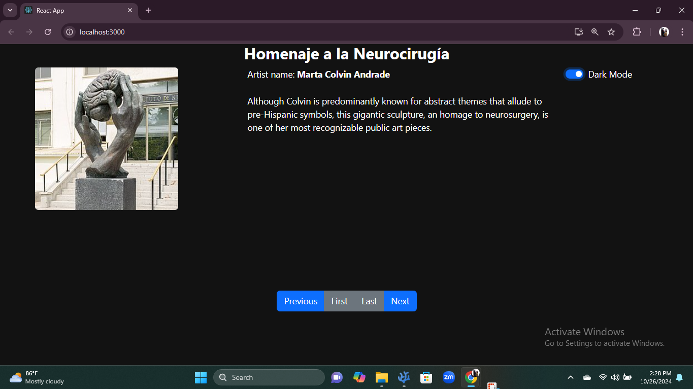
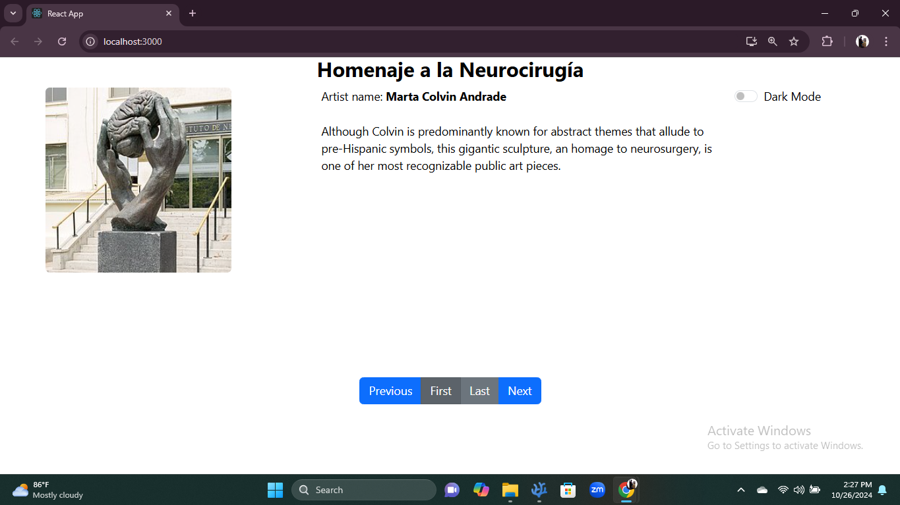
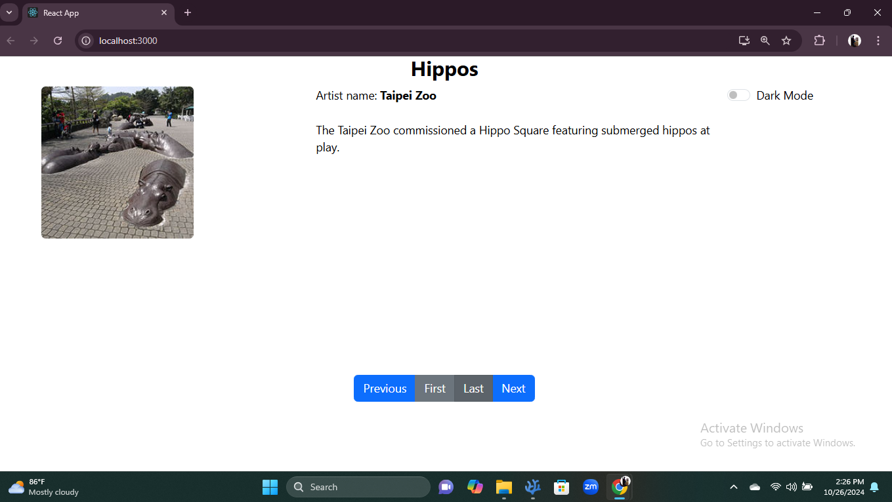
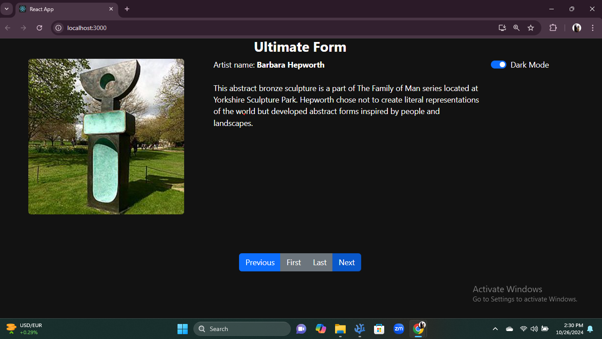
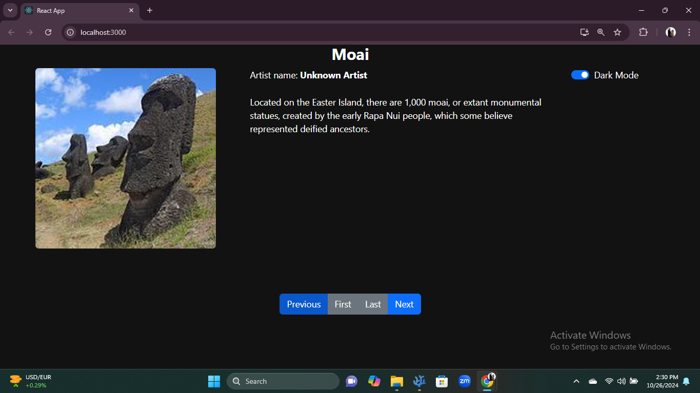

# Assignment 1
This React project is a **Sculpture Gallery App** showcasing various sculptures with their images, descriptions, and details. It demonstrates **parent-to-child** and **child-to-parent communication** using props and callback functions. It also includes a **dark mode toggle** for enhanced user experience.

---

## Features

1. **Parent-Child Communication**
   - Parent components pass props to child components to share data.
   - Callback functions allow child components to communicate back to the parent and update its state.

2. **Dynamic Navigation**
   - Navigate through a list of sculptures using "Next," "Previous," "First," and "Last" buttons.
   - Maintain the current sculpture state and render details dynamically.

3. **Dark Mode Toggle**
   - The app features a dark mode toggle implemented using React state and callback functions.

4. **Bootstrap Integration**
   - Utilizes **React-Bootstrap** for styling and layout.

5. **Modular Design**
   - Components are reusable and separated for cleaner, maintainable code.

---

## Folder Structure

```
src/
├── App.css                     // Global styles for the application
├── App.js                      // Main app component
├── components/
│   ├── Assignment1/
│   │   ├── Sculpture.js        // Parent component handling sculpture data
│   │   ├── Title.js            // Child component rendering the sculpture's title
│   │   ├── Image.js            // Child component rendering the sculpture's image
│   │   ├── Artist.js           // Child component displaying the artist's name
│   │   ├── Description.js      // Child component showing the sculpture description
│   │   ├── DarkMode.js         // Child component for toggling dark mode
│   └── data.js                 // Sculpture data array
├── index.js                    // Entry point rendering the App component
└── index.css                   // Base styles for the app
```

---

## Component Breakdown

### 1. **App Component** (`App.js`)  
   - Manages the overall state and layout of the app.
   - Includes the `Sculpture` component and initializes dark mode.

### 2. **Sculpture Component** (`Sculpture.js`)  
   - Manages the state of the currently displayed sculpture (`index`).
   - Contains navigation functions (`nextEle`, `prevEle`, `firstEle`, `lastEle`).
   - Passes dark mode state and sculpture data to child components.

### 3. **Child Components**
   - **Title** (`Title.js`): Displays the sculpture's name.
   - **Image** (`Image.js`): Renders the sculpture's image using a URL.
   - **Artist** (`Artist.js`): Shows the artist's name.
   - **Description** (`Description.js`): Presents a detailed description of the sculpture.
   - **DarkMode** (`DarkMode.js`): Toggle switch for dark mode functionality.

### 4. **Data File** (`data.js`)  
   - Contains an array of sculptures, each with `name`, `artist`, `description`, `url`, and `alt` properties.

---

## Workflow

1. **Parent to Child Communication**
   - The parent (`Sculpture`) passes props like `url`, `alt`, `artist`, `description`, and `darkMode` to child components for rendering.

2. **Child to Parent Communication**
   - The `DarkMode` component calls a function (`isDark`) passed as a prop to update the parent's state.

3. **Dynamic State Updates**
   - The current sculpture is updated through navigation buttons, with state changes reflecting instantly in the UI.

---

### Output




