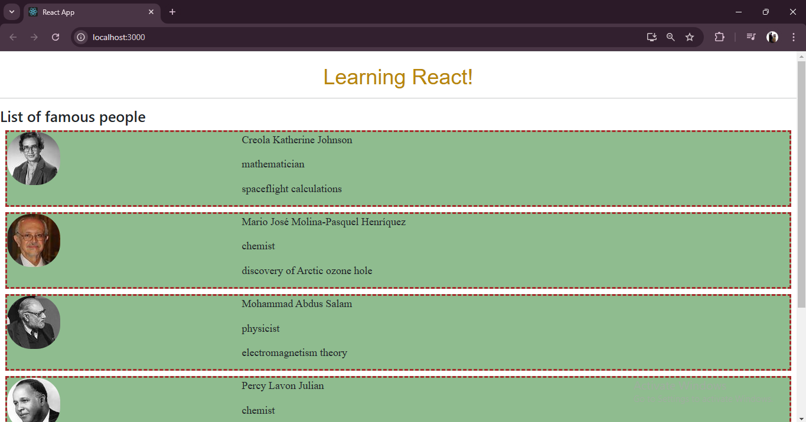

This project is a simple React.js application designed to demonstrate the fundamental concepts of React, including component-based architecture, props, state management, and dynamic rendering of content. The app showcases a list of famous personalities along with their achievements, using reusable components and external CSS for styling.

---

## Features

1. **Component-Based Architecture**  
   - The application consists of reusable components: `Header`, `Body`, `Footer`, and `People`.  
   - These components work together to render the application's structure dynamically.  

2. **Dynamic Content Rendering**  
   - Data for the personalities is stored in a `data.js` file and rendered dynamically using the `map()` function in the `Body` component.  

3. **Image Rendering**  
   - Profile images are fetched dynamically based on the data provided in the `data.js` file, enhancing visual presentation.  

4. **Styling**  
   - External CSS (`main.css`) is used for styling the components, ensuring a clean and modern UI.  
   - Classes like `header`, `footer`, and `maincard` define distinct sections for a polished layout.  

---

## Folder Structure  

```
src/
├── App.js               // Main entry point of the app
├── assets/
│   └── Day2/
│       └── css/
│           └── main.css  // CSS file for styling
├── components/
│   └── Day2_08_10/
│       ├── Header.js    // Header component
│       ├── Body.js      // Main content rendering component
│       ├── Footer.js    // Footer component
│       ├── People.js    // Sub-component for displaying individual profiles
│       └── data.js      // Data source for dynamic rendering
└── index.js             // React app entry point
```

---

## Component Breakdown

1. **Header** (`Header.js`)  
   - Displays the app title: *Learning React!*  
   - Styled with external CSS and includes a horizontal rule for separation.

2. **Body** (`Body.js`)  
   - Renders a list of famous personalities dynamically using the `people` data array.  
   - Utilizes the `People` component to render individual details such as name, profession, and accomplishments.

3. **Footer** (`Footer.js`)  
   - Provides a footer with a message about the purpose of the app.  

4. **People** (`People.js`)  
   - Sub-component for rendering individual cards with a profile picture, name, profession, and accomplishment.

5. **Data** (`data.js`)  
   - Contains an array of objects, each representing a famous personality.  

---

## How the App Works  

1. The `App.js` file combines the `Header`, `Body`, and `Footer` components to form the main application.  
2. The `Body` component dynamically maps over the `people` array and renders the `People` component for each entry.  
3. The `People` component uses props to display details and fetch profile images using URLs dynamically generated from the `imageId` property.  
4. External CSS styles are applied to maintain consistency and aesthetics across the app.  

---

### Output
