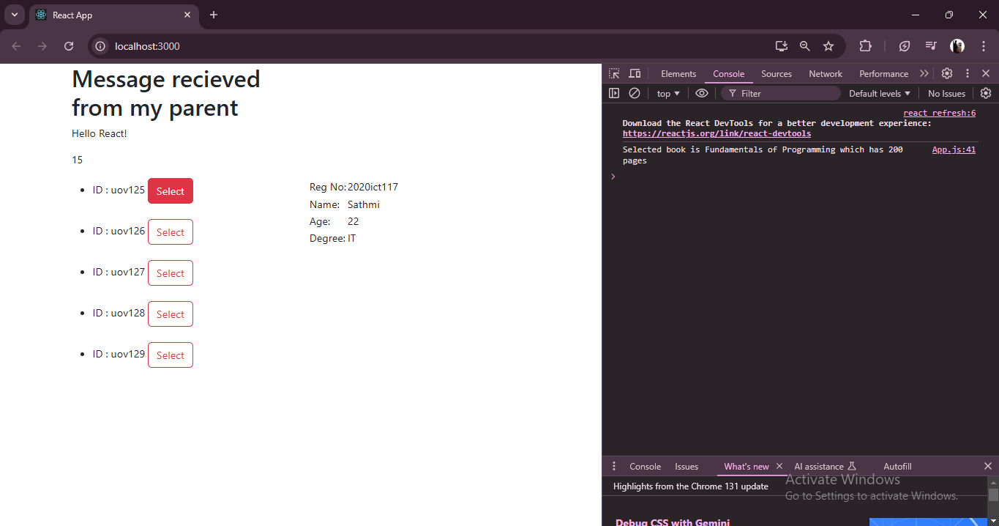

### README.md for React Application with Bootstrap Integration

# React Bootstrap Demo Application

This project demonstrates the usage of React with **React-Bootstrap** for building a dynamic and interactive application. It includes components for managing books, displaying student information, and performing operations through parent-child communication with props.

---

## Features

1. **React-Bootstrap Integration**  
   - Utilizes `Container`, `Row`, and `Col` for layout management.  
   - Incorporates styled buttons for interactions using Bootstrap variants.

2. **Dynamic Component Interaction**  
   - `Books` component dynamically renders a list of books and supports selection through a callback function.  
   - `Mycont` component demonstrates communication between parent and child using props for messages and operations.  

3. **Reusable and Functional Components**  
   - Components like `Student` and `Books` are modular and reusable across the app.

4. **Props and Event Handling**  
   - Components receive dynamic data through props and handle user events such as button clicks.

---

## Folder Structure  

```
src/
├── App.js               // Main entry point integrating all components
├── components/
│   └── Day3_15_10/
│       ├── Books.js     // Displays a list of books with a selection feature
│       ├── Mycont.js    // Displays a message and calculates a sum
│       ├── Student.js   // Displays student details in a tabular format
└── index.js             // React app entry point
```

---

## Component Breakdown

1. **Books** (`Books.js`)  
   - Renders a list of books passed through props (`bdata`) and allows selecting a book using a callback (`onSelectBook`).  
   - Utilizes Bootstrap's `Button` component for actions.

2. **Mycont** (`Mycont.js`)  
   - Demonstrates parent-to-child communication by passing a message and a function to calculate the sum of two numbers.  

3. **Student** (`Student.js`)  
   - Displays student details in a table format using props (`regno`, `name`, `age`, `degree`).  

---

## App Workflow  

1. **Parent-Child Communication**  
   - The `App.js` component passes data (e.g., books and functions) to child components like `Books` and `Mycont`.

2. **Dynamic Data Rendering**  
   - The `Books` component maps through the list of books and renders them dynamically.

3. **Bootstrap Styling**  
   - The layout and buttons are styled using React-Bootstrap components, ensuring responsiveness and aesthetics.

---

### Output
  
