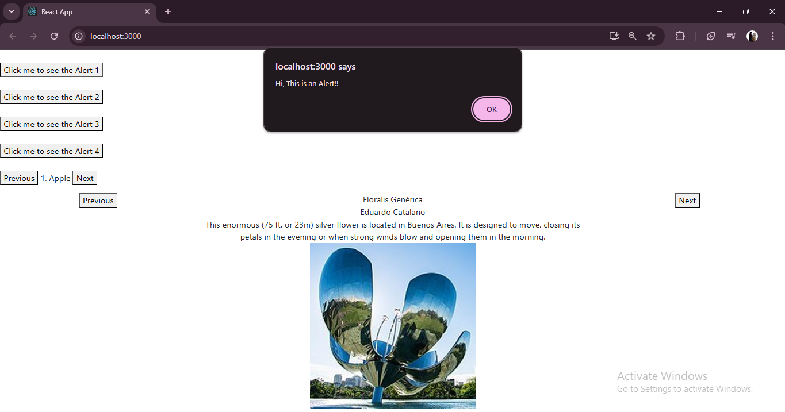

# Day 4 ( 2024/10/22 )
This React project combines interactive features like alerts, carousel functionality, and a dynamically rendered artist gallery. It showcases state management with `useState`, component reusability, and integration with React-Bootstrap for responsive design.

---

## Features

1. **Alert Buttons**  
   - Multiple alert buttons demonstrate different ways to bind functions, including inline arrow functions, named functions, and functions passed via props.

2. **Carousel Functionality**  
   - A fruit carousel allows users to navigate through a list of fruits using "Previous" and "Next" buttons.  
   - An artist gallery displays artwork with details, including the artist's name, description, and an image.

3. **React-Bootstrap Integration**  
   - Uses Bootstrap components (`Container`, `Row`, `Col`) for a responsive layout.  
   - Stylized buttons for navigation.

4. **Dynamic Data Rendering**  
   - Artist gallery dynamically displays data from a JSON-like array (`sculptureList`) passed through the `Artist` component.

---

## Folder Structure

```
src/
├── App.js                 // Main entry point for the application
├── componenets/
│   └── Day4_22_10/
│       ├── Artist.js      // Displays artwork and details with navigation
│       ├── data.js        // Contains the list of sculptures
├── index.js               // Entry point rendering the App component
└── index.css              // Styles for the application
```

---

## Component Breakdown

1. **App Component** (`App.js`)  
   - Integrates all functionalities, including alert buttons, fruit carousel, and artist gallery.  
   - Manages state for carousel navigation and demonstrates function binding for event handling.

2. **Artist Component** (`Artist.js`)  
   - Displays a gallery of sculptures with information like name, artist, description, and an image.  
   - Includes "Previous" and "Next" buttons to navigate through the artwork list.  
   - Uses React-Bootstrap for responsive layout and fluid design.

3. **Data** (`data.js`)  
   - Contains an array of sculpture details with fields like `name`, `artist`, `description`, `url`, and `alt`.  

---

## Workflow

1. **Alerts**  
   - Demonstrates the flexibility of React event handling using various approaches like arrow functions, inline functions, and functions from props.

2. **Carousel Navigation**  
   - Enables cyclic navigation through a list of fruits and sculptures.  
   - Updates the UI based on the current index managed with React state (`useState`).

3. **Artist Gallery**  
   - Dynamically renders the details of sculptures from the `sculptureList`.  
   - Provides navigation between sculptures using buttons.

---

### Output
 