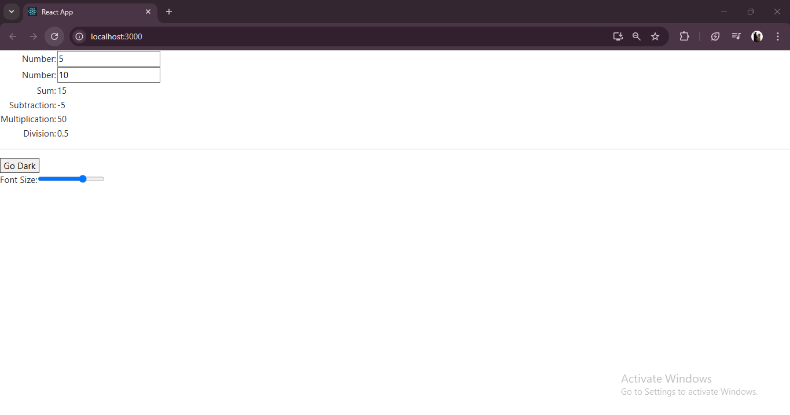

This React project is a **simple calculator application** with dynamic theming and font size adjustment. It showcases state management using `useState`, component reusability, and a clean, responsive design.

---

## Features

1. **Calculator Functionality**  
   - Perform basic arithmetic operations:
     - Addition
     - Subtraction
     - Multiplication
     - Division  
   - Inputs dynamically update the results as numbers are entered.  

2. **Dynamic Theming**  
   - Switch between **Light Theme** and **Dark Theme** using a toggle button.  
   - Themes adjust the background and text color dynamically.  

3. **Adjustable Font Size**  
   - Use a slider to dynamically adjust the font size of the entire application between 10px and 20px.

4. **React State Management**  
   - State (`useState`) is used to manage theme selection, font size, and input numbers.  

---

## Folder Structure

```
src/
├── App.js                   // Main application component
├── components/
│   └── Day5_29_10/
│       └── Calculator.js    // Calculator functionality
├── index.js                 // Entry point rendering the App component
└── index.css                // Application styles
```

---

## Component Breakdown

### 1. **App Component** (`App.js`)  
   - Manages application-level state, including:  
     - Theme (`light` or `dark`).  
     - Font size (via a slider).  
   - Integrates the `Calculator` component.  
   - Provides the UI for theme toggling and font size adjustment.  

### 2. **Calculator Component** (`Calculator.js`)  
   - Allows users to input two numbers and dynamically view the results of:  
     - Addition  
     - Subtraction  
     - Multiplication  
     - Division  
   - Uses controlled inputs for number handling.  

---

## Workflow

1. **Dynamic Theme Toggle**  
   - Users can switch between light and dark themes with a button.  
   - The button text updates to reflect the current theme.

2. **Font Size Adjustment**  
   - A slider dynamically adjusts the font size of the content between 10px and 20px.  
   - Changes are applied in real-time.

3. **Calculator Operations**  
   - As users input numbers, the results of all operations (add, subtract, multiply, divide) update instantly.  

---

### Output Example
  
