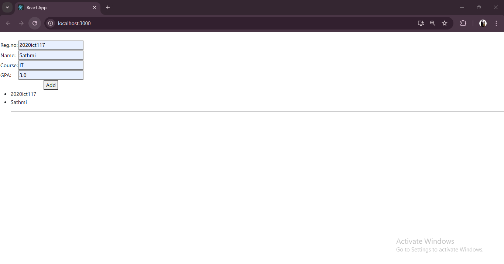

This React application provides a **student management system** where users can add and view student details dynamically. It showcases the use of controlled components, array manipulation, and state management using `useState`.

---

## Features

1. **Student Information Input**  
   - Users can input details for a student:
     - Registration Number (`regno`)
     - Name
     - Course
     - GPA  

2. **Add Students to List**  
   - Upon clicking the **"Add"** button, the entered details are saved to a list of students.  
   - The student list is updated dynamically.

3. **Display Student Details**  
   - Dynamically renders the list of added students with their registration number and name.

4. **State Management**  
   - The `useState` hook manages the individual student input and the list of all students.  

---

## Folder Structure

```
src/
├── App.js                    // Main application component
├── components/
│   └── Day6_05_11/
│       └── StudentIn.js      // Component for student information management
├── index.js                  // Entry point rendering the App component
└── index.css                 // Styles for the application
```

---

## Component Breakdown

### 1. **App Component** (`App.js`)  
   - Acts as the root component.  
   - Integrates the `StudentIn` component.

### 2. **StudentIn Component** (`StudentIn.js`)  
   - Handles:
     - Input of student details via controlled form elements.  
     - Dynamic updates to the student list.  
   - Features:  
     - **`getStudent` function**: Updates the state for individual student fields.  
     - **`addStudents` function**: Adds the current student to the student list.

---

## Workflow

1. **Student Input**  
   - Users input details for a student (e.g., `regno`, `name`, `course`, and `gpa`) into text fields.

2. **Add Student**  
   - Clicking **"Add"** appends the student to the `students` array while preserving existing entries.

3. **Dynamic List Rendering**  
   - The list of added students is rendered dynamically as `<ul>` elements displaying `regno` and `name`.

---

## Output
