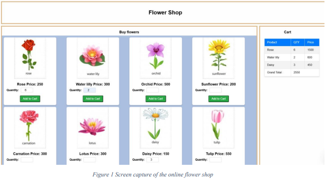

# IT3133: Mobile Communication and Computing  
### ICAE 01  

**Department of Physical Science**  
**Faculty of Applied Science, University of Vavuniya**  

**Date:** 3rd December 2024  
**Duration:** 1 hour  

---

## Instructions:  
- The React project is available in the shared drive as a ZIP file. Copy it to your local drive and extract it.  
- The project is embedded with the necessary data, images, and style sheets.  
- After finishing your code work, place only the `src` folder in the Z drive.  

---

## Question:  
You are requested to develop the front end of an online flower shop e-commerce application.  

For the initial step, you must complete the given task with efficient programming methods and component architecture.  

The task details are elaborated below:  

### Technology:  
- **React**  

### Editor:  
- **VS Code**  

---

### Prototype:  
 

---

## Requirements:  
1. On the left side, display the flowers, their image, name, and price.  
   **[30 Marks]**  
2. The buyer should be able to enter the quantity of flowers needed and add them to the cart.  
   **[35 Marks]**  
3. On the right side, display a shopping cart table that contains:  
   - The flower name.  
   - Quantity.  
   - The total price of each flower.  
   - Finally, the total price of the whole purchase.  
   **[35 Marks]**  